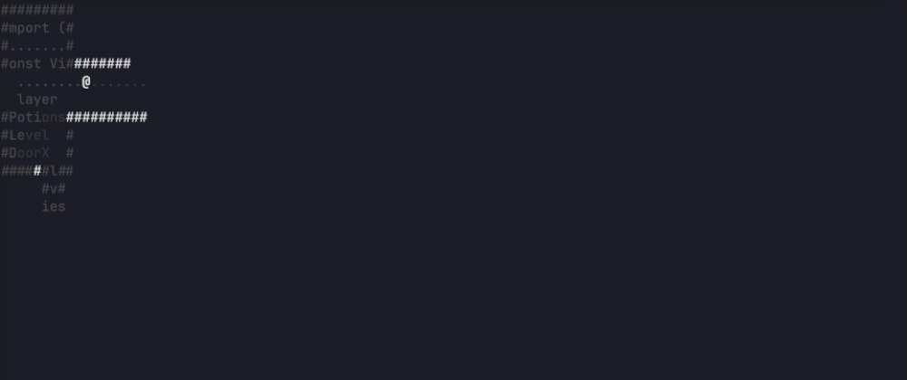

# gh-dungeons 🎮

A procedurally generated roguelike dungeon crawler that turns your repos into a unique playable game!

Built using [GitHub Copilot CLI](https://github.com/features/copilot/cli) for the [GitHub Copilot CLI Challenge](https://dev.to/leereilly/a-procedurally-generated-github-cli-roguelike-where-every-dungeon-is-built-from-your-code-1ef).



## Installation

```bash
gh extension install leereilly/gh-dungeons
```

Or build from source:
```bash
git clone https://github.com/leereilly/gh-dungeons
cd gh-dungeons
go build -o gh-dungeons
```

## Usage

Navigate to any Git repository and run:
```bash
gh dungeons
```

WASD, arrow keys, and Vim keys (because of course)

## Controls

| Key | Action |
|-----|--------|
| `↑` `w` `k` | Move up |
| `↓` `s` `j` | Move down |
| `←` `a` `h` | Move left |
| `→` `d` `l` | Move right |
| `y` `u` `b` `n` | Diagonal movement |
| `q` `Esc` | Quit |

## Gameplay

- **You** are `@` with 20 HP
- **Bugs** `b` - Weak enemies (1 HP, 1 damage)
- **Scope Creeps** `c` - Tougher enemies (3 HP, 2 damage)
- **Health Potions** `+` - Restore 3 HP
- **Door** `>` - Descend to the next level

### Features

- **BSP-tree dungeon generation** - procedurally created rooms and corridors
- **Fog of war** - limited vision radius, explored areas stay visible
- **Enemy AI** - enemies chase you when in line of sight
- **Auto-attack** - automatically attack adjacent enemies
- **Stats tracking** - kills and levels cleared
- <mark>**And way, way, waaay more**</mark> - intentionally undocumented, but there for you to discover as new ones are added.

### Objective

Survive 5 dungeon levels by finding the hidden door `>` on each floor. Kill bugs and scope creeps, collect potions, and make it to the end!

## How It Works

### 1) Repo scanning → code backgrounds

When you run `gh dungeons`, the game scans the current directory (skipping common vendor/build folders) and collects code files that:
- match a known set of code extensions (`.go`, `.js`, `.py`, `.rs`, etc.)
- are at least 60 lines long (to keep backgrounds interesting)

It prefers longer files and keeps up to a small set of top candidates. Each dungeon level uses one of these files as its “floor text” background.

### 2) Deterministic seeding (why your dungeon is “your dungeon”)

Dungeon generation uses a deterministic RNG seed derived from:
- your repo identity (remote origin URL when available, otherwise the repo folder name)
- the current `HEAD` commit SHA
- hashes of the selected code file contents

That means:
- the **same repo at the same commit** will generate the **same** dungeon layouts
- changing commits (or code) will typically change the seed and the resulting dungeons

### 3) Level lifecycle (how a floor is created)

Each time a new level is generated:

1. **Map size is set from your terminal**
   - The dungeon width/height are based on your current terminal size.
   - A few lines are reserved for the UI at the bottom.
   - Minimum size is enforced so it’s always playable.

2. **A code file is chosen for the level background**
   - Levels rotate through the scanned code files (e.g. level 1 uses file 1, level 2 uses file 2, etc.).

3. **A dungeon map is generated**
   - Rooms and corridors are created using BSP (details below).

4. **Entities are placed**
   - Player spawns in the first room.
   - A **door `>`** is placed on a walkable tile.
   - Enemies spawn (more each level).
   - Potions spawn (scaled by level).
   - A merge conflict trap is placed once per level.

### Dungeon Generation (BSP)

Dungeons are procedurally generated using **Binary Space Partitioning (BSP) trees**:

1. **Partitioning**
   - The map starts as a single rectangle, then recursively splits into smaller sections (either horizontally or vertically).

2. **Room creation**
   - Leaf nodes of the BSP tree become rooms with randomized dimensions.

3. **Corridor carving**
   - Rooms are connected via L-shaped corridors by traversing the BSP tree and linking sibling nodes.

Because the RNG is seeded from your repo + commit + file hashes, the overall layout is reproducible for a given snapshot of your repository.

## License

MIT
