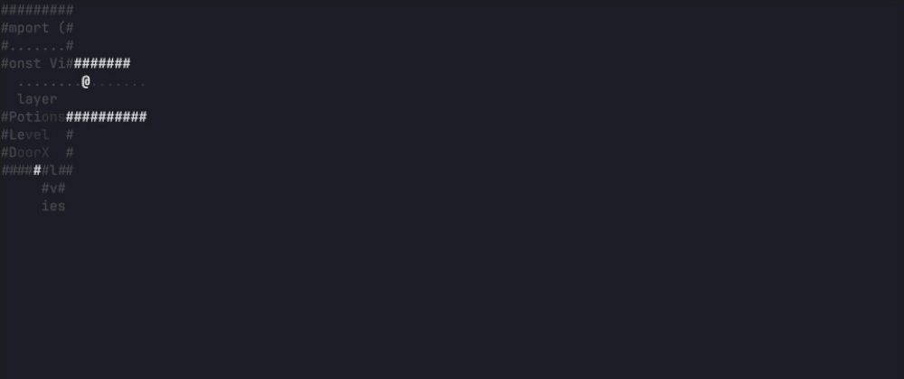

# gh-dungeons 🎮

A procedurally generated roguelike dungeon crawler that turns your repos into a unique playable game!

Built using [GitHub Copilot CLI](https://github.com/features/copilot/cli) for the [GitHub Copilot CLI Challenge](https://dev.to/leereilly/a-procedurally-generated-github-cli-roguelike-where-every-dungeon-is-built-from-your-code-1ef).



## Installation

```bash
gh extension install leereilly/gh-dungeons
```

Or build from source:
```bash
git clone https://github.com/leereilly/gh-dungeons
cd gh-dungeons
go build -o gh-dungeons
```

## Usage

Navigate to any Git repository and run:
```bash
gh dungeons
```

WASD, arrow keys, and Vim keys (because of course)

## Controls

| Key | Action |
|-----|--------|
| `↑` `w` `k` | Move up |
| `↓` `s` `j` | Move down |
| `←` `a` `h` | Move left |
| `→` `d` `l` | Move right |
| `y` `u` `b` `n` | Diagonal movement |
| `q` `Esc` | Quit |

## Gameplay

- **You** are `@` with 20 HP
- **Bugs** `b` - Weak enemies (1 HP, 1 damage)
- **Scope Creeps** `c` - Tougher enemies (3 HP, 2 damage)
- **Health Potions** `+` - Restore 3 HP
- **Door** `>` - Descend to the next level

### Features

- **BSP-tree dungeon generation** - procedurally created rooms and corridors
- **Fog of war** - limited vision radius, explored areas stay visible
- **Enemy AI** - enemies chase you when in line of sight
- **Auto-attack** - automatically attack adjacent enemies
- **Stats tracking** - kills and levels cleared
- <mark>**And way, way, waaay more**</mark> - intentionally undocumented, but there for you to discover as new ones are added.

### Objective

Survive 5 dungeon levels by finding the hidden door `>` on each floor. Kill bugs and scope creeps, collect potions, and make it to the end!

### Super, _super_ hard more with _permanent_ permadeath

If you're insane, you can set up a pre-commit hook that forces you to beat the game or lose your staged changes 😆

```bash
# Create the pre-commit hook
cat > .git/hooks/pre-commit << 'EOF'
#!/bin/bash
gh dungeons
if [ $? -ne 0 ]; then
    echo "You died! Your changes have been stashed into oblivion..."
    git stash && git stash drop stash@{0}
    exit 1
fi
EOF

# Make it executable
chmod +x .git/hooks/pre-commit
```

Now every commit requires you to survive the dungeon. Lose, and your changes are gone forever. 💀

## Documentation

For technical documentation aimed at modders, contributors, and those who want to understand or extend the game, see the **[`docs/`](./docs/)** directory:

- **[Architecture](./docs/architecture.md)** — System overview, entry points, build commands
- **[Dungeon Generation](./docs/dungeon-generation.md)** — BSP algorithm explained with ASCII diagrams
- **[Entities](./docs/entities.md)** — Complete reference for player, enemies, items
- **[Seeding](./docs/seeding.md)** — Deterministic RNG and reproducibility
- **[Modding Guide](./docs/modding.md)** — Step-by-step guides for adding content

## License

MIT
